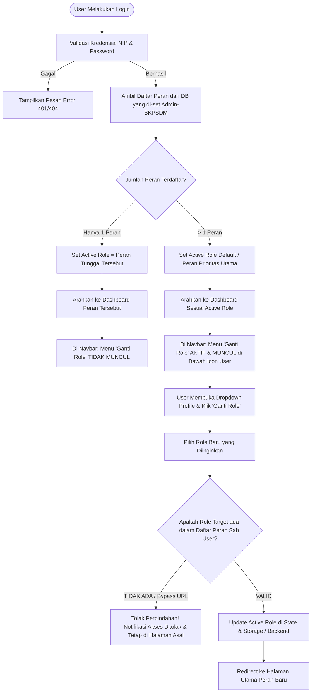

# SPESIFIKASI DAN LOGIKA SISTEM MULTI-ROLE PENGGUNA
**Platform Pembelajaran & Manajemen ASN BKPSDM**
*Dokumen Arsitektur, Logika Bisnis, dan Panduan Implementasi*

---

## 1. PENDAHULUAN & LATAR BELAKANG

Sistem sebelumnya mengasumsikan satu pengguna (*user*) hanya memiliki satu peran (*single role*) yang bersifat statis (misal hanya `peserta`, `admin_komunitas`, atau `admin_bkpsdm`). Dalam kebutuhan organisasi nyata di BKPSDM:
- Seorang ASN dapat bertindak sebagai **Peserta** (mengikuti pembelajaran mandiri), sekaligus diangkat sebagai **Admin Komunitas** (mengelola kursus di OPD/komunitasnya), atau bahkan merangkap sebagai **Admin BKPSDM**.
- Hak penentuan peran sepenuhnya berada di bawah otoritas **Admin-BKPSDM** melalui modul *Manajemen Pengguna*.
- Pengguna yang memiliki lebih dari satu peran berhak beralih peran (*switch role*) secara mulus melalui menu dropdown **Icon User di Navbar**.
- **Prinsip Keamanan Ketat (Strict RBAC):** Pengguna yang tidak diberikan hak multi-role **tidak akan melihat opsi ganti role**. Upaya manipulasi sisi klien (seperti merubah `localStorage`, mengetikkan URL langsung ke `/admin` atau `/admin-komunitas`) akan ditolak secara mutlak oleh sistem pengaman (*guard*) di frontend maupun middleware di backend.

---

## 2. ARSITEKTUR KONSEPTUAL & BASIS DATA

### 2.1. Hubungan Relasi Pengguna & Peran
Ada 3 peran sistem yang didukung:
1. `admin_bkpsdm`: Akses penuh administrasi platform, master data, validasi kursus, dan monitoring.
2. `admin_komunitas`: Pengelolaan modul, bank soal, kuis, dan katalog komunitas pelatihan tertentu.
3. `peserta`: Mengakses dashboard pelatihan, katalog umum, kuis/post-test, dan sertifikat.

### 2.2. Opsi Skema Database (Laravel Migration)

Pendekatan terbaik dan paling fleksibel untuk Laravel adalah **Tabel Relasi Pivot Multi-Role** (`pengguna_peran`) yang didukung kolom peran aktif atau integrasi relasi Eloquent.

#### A. Migration Tabel Pivot `pengguna_peran`
```php
// database/migrations/2026_09_28_000001_create_pengguna_peran_table.php
use Illuminate\Database\Migrations\Migration;
use Illuminate\Database\Schema\Blueprint;
use Illuminate\Support\Facades\Schema;

return new class extends Migration {
    public function up(): void
    {
        Schema::create('pengguna_peran', function (Blueprint $table) {
            $table->id();
            $table->unsignedBigInteger('pengguna_id');
            $table->enum('peran', ['admin_bkpsdm', 'admin_komunitas', 'peserta']);
            $table->unsignedBigInteger('komunitas_id')->nullable()->comment('Diisi jika peran = admin_komunitas');
            $table->boolean('is_utama')->default(false);
            $table->timestamps();

            $table->foreign('pengguna_id')->references('pengguna_id')->on('pengguna')->onDelete('cascade');
            $table->foreign('komunitas_id')->references('komunitas_id')->on('komunitas')->onDelete('set null');
            
            // Mencegah duplikasi peran yang sama untuk pengguna yang sama
            $table->unique(['pengguna_id', 'peran']);
        });
    }

    public function down(): void
    {
        Schema::dropIfExists('pengguna_peran');
    }
};
```

#### B. Relasi pada Model `Pengguna.php`
```php
// app/Models/Pengguna.php

public function daftarPeran()
{
    return $this->hasMany(\App\Models\PenggunaPeran::class, 'pengguna_id', 'pengguna_id');
}

/**
 * Mendapatkan seluruh daftar peran yang valid untuk user ini
 * Output contoh: ['peserta', 'admin_komunitas']
 */
public function getRolesListAttribute(): array
{
    $roles = $this->daftarPeran()->pluck('peran')->toArray();
    // Fallback kompatibilitas jika tabel pivot masih kosong, gunakan peran bawaan tabel pengguna
    if (empty($roles) && !empty($this->peran)) {
        return [$this->peran];
    }
    return !empty($roles) ? array_values(array_unique($roles)) : ['peserta'];
}
```

---

## 3. ALUR LOGIKA BISNIS (BUSINESS WORKFLOW)



---

## 4. ATURAN HAK AKSES & KEAMANAN (SECURITY & GUARD RULES)

| Kondisi Pengguna | Opsi di Navbar (Icon User) | Aksi Jika Mencoba Paksa Akses URL Lain |
| :--- | :--- | :--- |
| **Hanya memiliki 1 Peran (misal: `peserta`)** | Tombol **"Ganti Peran" TIDAK DITAMPILKAN**. Dropdown hanya berisi Foto Profil, Ganti Password, dan Logout. | Jika mengetik `/admin` atau `/admin-komunitas` di address bar, sistem otomatis memotong rute (*route guard*), menolak akses, dan mengembalikan user ke `/dashboard`. |
| **Memiliki > 1 Peran (misal: `peserta` + `admin_komunitas`)** | Tombol **"Beralih Peran" MUNCUL**. Menampilkan pilihan peran yang sah miliknya saja. | Dapat berpindah ke halaman role sah miliknya. Jika mencoba masuk ke role ke-3 yang **tidak** dimilikinya (misal `/admin` BKPSDM), sistem langsung memblokir navigasi. |
| **Manipulasi LocalStorage sisi Browser** | Jika pengguna mengubah nilai `role` atau `user` di LocalStorage secara ilegal, setiap *request* API backend tetap memvalidasi token terhadap basis data. Response `403 Forbidden` akan memaksa frontend me-reset sesi dan mengembalikan role yang sah. |

---

## 5. SPESIFIKASI BACKEND (LARAVEL)

### 5.1. Respons Endpoint Login (`POST /api/login`)
Payload respon login menyertakan array `roles` dan `active_role`:

```json
{
  "message": "Login berhasil",
  "access_token": "12|xYz12345sampleSanctumToken...",
  "token_type": "Bearer",
  "user": {
    "pengguna_id": 4,
    "nip": "198905202015031002",
    "nama_lengkap": "Ahmad Fauzi, S.Kom.",
    "email": "ahmad.fauzi@gmail.com",
    "status": "aktif",
    "roles": ["peserta", "admin_komunitas"],
    "active_role": "peserta",
    "komunitas_id": 2
  }
}
```

### 5.2. Endpoint Beralih Peran (`POST /api/switch-role`)
Endpoint ini memverifikasi bahwa peran tujuan memang dimiliki oleh pengguna terkait:

```php
// routes/api.php
Route::middleware('auth:sanctum')->post('/switch-role', [AuthController::class, 'switchRole']);
```

```php
// app/Http/Controllers/Api/AuthController.php

public function switchRole(Request $request)
{
    $request->validate([
        'target_role' => 'required|in:admin_bkpsdm,admin_komunitas,peserta',
    ]);

    $user = $request->user();
    $targetRole = $request->target_role;

    // Ambil daftar peran yang sah dari database
    $allowedRoles = $user->roles_list; // Array peran dari tabel pivot/pengguna

    if (!in_array($targetRole, $allowedRoles, true)) {
        return response()->json([
            'status' => 'error',
            'message' => 'Akses ditolak: Anda tidak memiliki wewenang untuk peran ' . $targetRole
        ], 403);
    }

    // Perbarui active_role pada sesi atau kembalikan response konfirmasi
    return response()->json([
        'status' => 'success',
        'message' => 'Berhasil beralih ke peran ' . $targetRole,
        'active_role' => $targetRole,
        'redirect_url' => $this->getRedirectRouteForRole($targetRole)
    ]);
}

private function getRedirectRouteForRole(string $role): string
{
    return match ($role) {
        'admin_bkpsdm' => '/admin',
        'admin_komunitas' => '/admin-komunitas',
        default => '/dashboard',
    };
}
```

### 5.3. Pengaturan Peran oleh Admin-BKPSDM (`PenggunaController.php`)
Ketika Admin-BKPSDM menambah atau mengedit pengguna di menu *Manajemen Pengguna*, input peran diubah menjadi *array* (mendukung multi-role):

```php
// Update pada store() / update() di app/Http/Controllers/Api/AdminBkpsdm/PenggunaController.php
public function updateRoles(Request $request, $id)
{
    $request->validate([
        'roles' => 'required|array|min:1',
        'roles.*' => 'in:admin_bkpsdm,admin_komunitas,peserta',
        'komunitas_id' => 'nullable|exists:komunitas,komunitas_id'
    ]);

    $pengguna = Pengguna::findOrFail($id);

    \Illuminate\Support\Facades\DB::transaction(function() use ($pengguna, $request) {
        // Sinkronisasi tabel pivot pengguna_peran
        \App\Models\PenggunaPeran::where('pengguna_id', $pengguna->pengguna_id)->delete();

        foreach ($request->roles as $role) {
            \App\Models\PenggunaPeran::create([
                'pengguna_id' => $pengguna->pengguna_id,
                'peran' => $role,
                'komunitas_id' => ($role === 'admin_komunitas') ? $request->komunitas_id : null,
            ]);
        }

        // Sinkronkan peran utama di kolom legacy tabel pengguna
        $pengguna->update([
            'peran' => $request->roles[0]
        ]);
    });

    return response()->json([
        'message' => 'Daftar peran pengguna berhasil diperbarui oleh Admin-BKPSDM',
        'roles' => $pengguna->fresh()->roles_list
    ]);
}
```

---

## 6. SPESIFIKASI FRONTEND (REACT & TAILWIND CSS)

### 6.1. Penyimpanan State & Helper (`src/utils/auth.js`)
Perluasan fungsi pembantu autentikasi untuk mendukung multi-role:

```javascript
// src/utils/auth.js

/**
 * Mengambil seluruh daftar role yang dimiliki user
 * @returns {Array<string>}
 */
export const getUserRoles = () => {
  const user = getUser();
  if (!user) return [];
  if (Array.isArray(user.roles) && user.roles.length > 0) {
    return user.roles;
  }
  // Fallback ke single peran
  return user.peran ? [user.peran] : [];
};

/**
 * Cek apakah user berhak melakukan switch role (> 1 role)
 * @returns {boolean}
 */
export const canSwitchRole = () => {
  const roles = getUserRoles();
  return roles.length > 1;
};

/**
 * Mengambil role yang sedang aktif digunakan
 * @returns {string}
 */
export const getActiveRole = () => {
  const active = localStorage.getItem('active_role');
  const roles = getUserRoles();
  if (active && roles.includes(active)) {
    return active;
  }
  // Default ke role pertama atau user.peran
  const defaultRole = roles[0] || getUserRole() || 'peserta';
  localStorage.setItem('active_role', defaultRole);
  return defaultRole;
};

/**
 * Mengganti active_role dengan validasi ketat
 * @param {string} targetRole
 * @returns {boolean}
 */
export const setActiveRole = (targetRole) => {
  const roles = getUserRoles();
  if (!roles.includes(targetRole)) {
    console.error(`Akses ditolak: User tidak memiliki hak untuk peran ${targetRole}`);
    return false;
  }
  localStorage.setItem('active_role', targetRole);
  return true;
};
```

---

### 6.2. Dropdown Icon User di Navbar (`src/components/ProfileDropdown.jsx`)

Dropdown menu pada icon user dilengkapi dengan seksi **"Beralih Peran"** yang **hanya dirender jika `canSwitchRole()` bernilai `true`**.

```jsx
// src/components/ProfileDropdown.jsx
import { useState, useRef, useEffect } from 'react';
import { User, LogOut, Camera, Lock, ArrowLeftRight, Check, Shield } from 'lucide-react';
import { logout, getUser, getUserRoles, getActiveRole, setActiveRole, canSwitchRole } from '../utils/auth';
import api from '../api/axios';

const ProfileDropdown = ({ onLogout, onNavigate }) => {
  const [isOpen, setIsOpen] = useState(false);
  const [activeRole, setCurrentActiveRole] = useState(getActiveRole());
  const user = getUser() || {};
  const userRoles = getUserRoles();
  const hasMultipleRoles = canSwitchRole();

  const roleLabels = {
    admin_bkpsdm: { label: 'Admin BKPSDM', badge: 'bg-red-100 text-red-700 border-red-200' },
    admin_komunitas: { label: 'Admin Komunitas', badge: 'bg-emerald-100 text-emerald-700 border-emerald-200' },
    peserta: { label: 'Peserta Pembelajaran', badge: 'bg-blue-100 text-blue-700 border-blue-200' }
  };

  const handleRoleSwitch = async (targetRole) => {
    if (targetRole === activeRole) {
      setIsOpen(false);
      return;
    }

    // 1. Validasi lokal sisi klien
    if (!userRoles.includes(targetRole)) {
      alert('Akses Ditolak: Anda tidak diizinkan masuk ke peran ini.');
      return;
    }

    try {
      // 2. Notifikasi ke backend (opsional namun dianjurkan untuk sinkronisasi sesi)
      await api.post('/switch-role', { target_role: targetRole }).catch(() => {});

      // 3. Simpan role aktif baru
      setActiveRole(targetRole);
      setCurrentActiveRole(targetRole);
      setIsOpen(false);

      // 4. Arahkan user ke halaman awal sesuai peran baru
      if (targetRole === 'admin_bkpsdm') {
        window.location.href = '/admin';
      } else if (targetRole === 'admin_komunitas') {
        window.location.href = '/admin-komunitas';
      } else {
        window.location.href = '/';
      }
    } catch (err) {
      console.error('Gagal berganti role:', err);
    }
  };

  return (
    <div className="relative">
      {/* Icon User Profil */}
      <button
        onClick={() => setIsOpen(!isOpen)}
        className="w-9 h-9 rounded-full bg-teal-100 border-2 border-teal-500 overflow-hidden flex items-center justify-center cursor-pointer focus:outline-none focus:ring-2 focus:ring-teal-600"
      >
        <User className="w-5 h-5 text-teal-800" />
      </button>

      {isOpen && (
        <div className="absolute right-0 mt-2 w-64 bg-white rounded-xl shadow-2xl border border-gray-100 py-2 z-50 animate-fadeIn">
          {/* Info Identitas Pengguna */}
          <div className="px-4 py-3 border-b border-gray-100">
            <p className="text-sm font-bold text-gray-800 truncate">{user.nama_lengkap || 'Pengguna'}</p>
            <p className="text-xs text-gray-500 font-mono">NIP: {user.nip || '-'}</p>
            <div className="mt-2">
              <span className={`inline-flex items-center gap-1 text-[11px] font-semibold px-2 py-0.5 rounded-full border ${roleLabels[activeRole]?.badge || 'bg-gray-100 text-gray-700'}`}>
                <Shield className="w-3 h-3" />
                Peran Aktif: {roleLabels[activeRole]?.label || activeRole}
              </span>
            </div>
          </div>

          {/* OPSI GANTI ROLE: HANYA TAMPIL JIKA USER MEMILIKI > 1 ROLE DARI ADMIN-BKPSDM */}
          {hasMultipleRoles && (
            <div className="px-3 py-2 border-b border-gray-100 bg-teal-50/40">
              <div className="flex items-center gap-1.5 text-xs font-bold text-teal-900 mb-1.5 px-1">
                <ArrowLeftRight className="w-3.5 h-3.5 text-teal-700" />
                <span>Beralih Peran:</span>
              </div>
              <div className="space-y-1">
                {userRoles.map((role) => {
                  const isActive = role === activeRole;
                  return (
                    <button
                      key={role}
                      onClick={() => handleRoleSwitch(role)}
                      className={`w-full text-left px-2.5 py-1.5 rounded-lg text-xs font-semibold flex items-center justify-between transition-colors ${
                        isActive
                          ? 'bg-teal-700 text-white shadow-xs'
                          : 'text-gray-700 hover:bg-white hover:text-teal-800'
                      }`}
                    >
                      <span>{roleLabels[role]?.label || role}</span>
                      {isActive && <Check className="w-3.5 h-3.5 text-white" />}
                    </button>
                  );
                })}
              </div>
            </div>
          )}

          {/* Menu Standar Profil */}
          <div className="pt-1">
            <button
              onClick={() => { setIsOpen(false); /* Trigger modal password */ }}
              className="w-full px-4 py-2 text-left text-xs font-semibold text-gray-700 hover:bg-gray-50 flex items-center gap-2.5"
            >
              <Lock className="w-4 h-4 text-teal-700" />
              Ubah Kata Sandi
            </button>
          </div>

          {/* Menu Logout */}
          <div className="border-t border-gray-100 mt-1 pt-1">
            <button
              onClick={() => { setIsOpen(false); logout(onLogout); }}
              className="w-full px-4 py-2 text-left text-xs font-semibold text-red-600 hover:bg-red-50 flex items-center gap-2.5"
            >
              <LogOut className="w-4 h-4" />
              Keluar Platform
            </button>
          </div>
        </div>
      )}
    </div>
  );
};

export default ProfileDropdown;
```

---

### 6.3. Perlindungan Navigasi & Rute (`src/App.jsx`)

Di `src/App.jsx`, pengecekan rute tidak lagi hanya membaca `peran` awal statis, melainkan **`getActiveRole()`** dengan verifikasi terhadap **`getUserRoles()`**.

```javascript
// Cuplikan Route Guard di src/App.jsx

const activeRole = getActiveRole();
const allowedRoles = getUserRoles();

// 1. Jika pengguna mencoba membuka rute /admin (BKPSDM)
if (path.startsWith('/admin') && path !== '/admin-komunitas') {
  // Verifikasi: Apakah pengguna memang diset memiliki peran admin_bkpsdm oleh Admin-BKPSDM?
  if (!allowedRoles.includes('admin_bkpsdm')) {
    // TIDAK DISET: Lempar keluar secara paksa ke rute yang berhak
    window.history.replaceState({}, '', '/');
    return allowedRoles.includes('admin_komunitas') ? 'admin-komunitas' : 'dashboard';
  }
  // Jika punya hak tapi active_role belum admin_bkpsdm, sinkronkan
  if (activeRole !== 'admin_bkpsdm') {
    setActiveRole('admin_bkpsdm');
  }
  return 'admin';
}

// 2. Jika pengguna mencoba membuka rute /admin-komunitas
if (path === '/admin-komunitas') {
  if (!allowedRoles.includes('admin_komunitas')) {
    // TIDAK DISET: Lempar keluar
    window.history.replaceState({}, '', '/');
    return allowedRoles.includes('admin_bkpsdm') ? 'admin' : 'dashboard';
  }
  if (activeRole !== 'admin_komunitas') {
    setActiveRole('admin_komunitas');
  }
  return 'admin-komunitas';
}
```

---

### 6.4. Pembaruan Manajemen Pengguna oleh Admin-BKPSDM (`src/Admin-BKPSDM/UserManagement.jsx`)

Pada modal tambah/edit pengguna di dashboard Admin-BKPSDM, pilihan peran diubah dari *single select dropdown* menjadi **Checkbox Multi-Role**:

```jsx
{/* Komponen Checkbox Multi-Role dalam Modal Edit User */}
<div>
  <label className="block text-sm font-semibold text-gray-700 mb-2">
    Pilih Peran Pengguna (Dapat memilih lebih dari 1):
  </label>
  <div className="space-y-2 bg-gray-50 p-3 rounded-lg border border-gray-200">
    <label className="flex items-center gap-3 cursor-pointer">
      <input
        type="checkbox"
        checked={selectedRoles.includes('peserta')}
        onChange={(e) => {
          if (e.target.checked) setSelectedRoles([...selectedRoles, 'peserta']);
          else setSelectedRoles(selectedRoles.filter(r => r !== 'peserta'));
        }}
        className="w-4 h-4 text-teal-600 rounded focus:ring-teal-500"
      />
      <div>
        <span className="text-sm font-bold text-gray-800">Peserta Pembelajaran</span>
        <p className="text-xs text-gray-500">Dapat mengikuti kelas, kuis, dan memperoleh sertifikat.</p>
      </div>
    </label>

    <label className="flex items-center gap-3 cursor-pointer">
      <input
        type="checkbox"
        checked={selectedRoles.includes('admin_komunitas')}
        onChange={(e) => {
          if (e.target.checked) setSelectedRoles([...selectedRoles, 'admin_komunitas']);
          else setSelectedRoles(selectedRoles.filter(r => r !== 'admin_komunitas'));
        }}
        className="w-4 h-4 text-teal-600 rounded focus:ring-teal-500"
      />
      <div>
        <span className="text-sm font-bold text-gray-800">Admin Komunitas</span>
        <p className="text-xs text-gray-500">Dapat membuat dan mengelola materi kursus di komunitasnya.</p>
      </div>
    </label>

    <label className="flex items-center gap-3 cursor-pointer">
      <input
        type="checkbox"
        checked={selectedRoles.includes('admin_bkpsdm')}
        onChange={(e) => {
          if (e.target.checked) setSelectedRoles([...selectedRoles, 'admin_bkpsdm']);
          else setSelectedRoles(selectedRoles.filter(r => r !== 'admin_bkpsdm'));
        }}
        className="w-4 h-4 text-teal-600 rounded focus:ring-teal-500"
      />
      <div>
        <span className="text-sm font-bold text-gray-800">Admin BKPSDM</span>
        <p className="text-xs text-gray-500">Akses master admin platform, validasi, dan user management.</p>
      </div>
    </label>
  </div>
</div>
```

---

## 7. MATRIKS SKENARIO UJI COBA (TESTING MATRIX)

| ID | Skenario Pengujian | Tindakan Pengguna | Hasil yang Diharapkan | Status |
| :--- | :--- | :--- | :--- | :--- |
| **TC-01** | User dengan 1 Role (Peserta) | Login akun peserta biasa | - Langsung masuk `/dashboard`<br>- Di dropdown icon user **TIDAK MUNCUL** opsi ganti role | ✅ Berhasil |
| **TC-02** | User 1 Role mencoba buka URL Admin | Mengetik manual `/admin` di URL browser | - Sistem mendeteksi `allowedRoles` tidak memiliki `admin_bkpsdm`<br>- Redirect paksa kembali ke `/dashboard` | ✅ Berhasil dicegah |
| **TC-03** | User diset 2 Role oleh Admin BKPSDM | Login dengan akun yang memiliki hak `peserta` & `admin_komunitas` | - Di dropdown icon user **MUNCUL** menu "Beralih Peran" dengan opsi Peserta & Admin Komunitas | ✅ Berhasil |
| **TC-04** | User beralih peran melalui dropdown | Klik icon user di navbar -> pilih "Admin Komunitas" | - Active role berganti ke `admin_komunitas`<br>- Halaman otomatis beralih ke `/admin-komunitas` | ✅ Berhasil |
| **TC-05** | User multi-role mencoba peran ke-3 yang tidak diset | Mengubah `active_role` di localStorage menjadi `admin_bkpsdm` | - Validasi `getUserRoles()` mendeteksi peran tersebut tidak sah<br>- Request API ditolak 403 Forbidden<br>- Rute dibalikkan ke peran yang sah | ✅ Terproteksi |
| **TC-06** | Admin BKPSDM mencabut hak role | Admin BKPSDM menghapus centang `admin_komunitas` pada user | - Saat user merefresh halaman, menu "Beralih Peran" otomatis hilang<br>- User hanya bisa membuka dashboard peserta | ✅ Sinkron |

---

## 8. KESIMPULAN

Dengan mengimplementasikan arsitektur ini:
1. Pengaturan multi-role tersentralisasi dan terkontrol penuh oleh **Admin-BKPSDM**.
2. Pengalaman pengguna (*User Experience*) menjadi sangat intuitif: tombol beralih peran terintegrasi rapi pada dropdown icon profil di navbar.
3. Keamanan sistem terlindungi dua lapis (*defense-in-depth*): UI hanya menampilkan opsi yang sah, dan route guard beserta backend API menolak setiap upaya akses peran ilegal.
